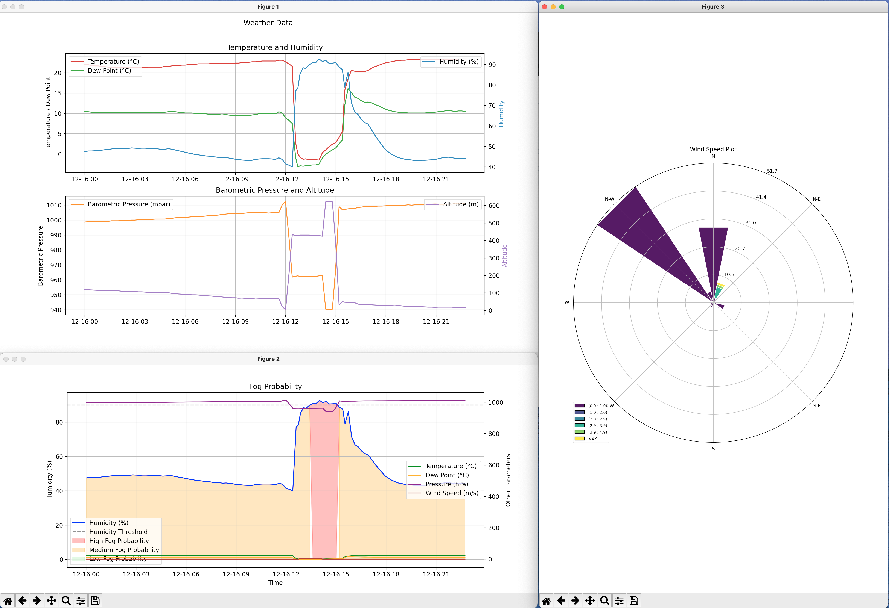

# Weather Meter Plotter
A simple Python script for plotting Kestrel Instruments 5500 weather meter data using matplotlib.



### Requirements

* Matplotlib
* Numpy
* Windrose

### How to plot data

**Step 1: Prepare CSV file for plotting**

1) Remove the first 3 lines that contain the Device Name, Device Mode, and Serial Number.
2) Line that contains the following data:
```
yyyy-MM-dd hh:mm:ss a,°C,°C,%,mb,m,mb,km/h,°C,°C,m,km/h,km/h,Deg,Deg,°C,Data Type,Record name,Start time,Duration (H:M:S),Location description,Location address,Location coordinates,Notes
```

3. In case that in our .CSV file we don't have information about any of the following items:
```
Data Type, Record name, Start time, Duration (H:M:S), Location description, Location address, Location coordinates, Notes
```

We should remove each empty column and unused data. For example

This log:
```
2023-12-16 12:00:00 AM,22.1,15.0,47.5,998.7,119,998.7,0.0,21.5,10.4,452,0.0,0.0,305,306,22.0,point
```

to convert into this:
```
2023-12-16 12:00:00 AM,22.1,15.0,47.5,998.7,119,998.7,0.0,21.5,10.4,452,0.0,0.0,305,306,22.0
```

and now, our charts will show the correct values.

**Step 2: Start Python script**

```
python3 app.py <path_to_csv_file>
```
